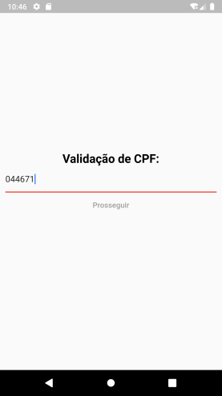

# App valida cpf/cnpj
 Aplicativo usando o `getX` para gerenciamento de estados na aplicação `Flutter.
 
  ### Projeto desenvolvido ultilizando:
  - [x] Flutter
  - [x] MVU
  - [x] get: ^3.12.1
  - [x] cpfcnpj: ^1.0.3
  
 ## Print Screen :foggy:

|  |
|:---:|
| Validar cpf ou cnpj | 
